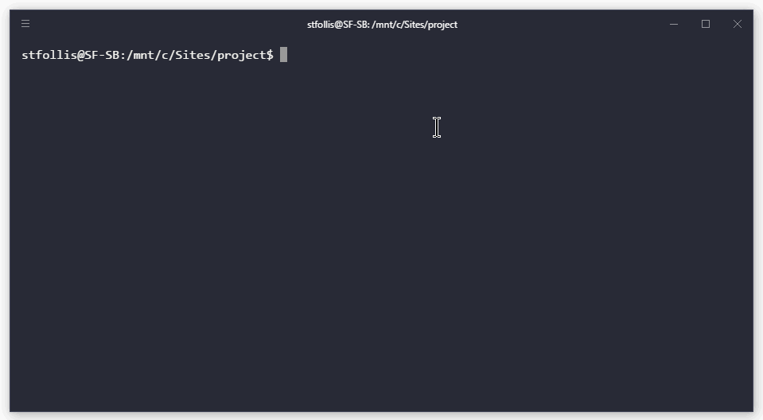

# generator-express-azuread [![NPM version][npm-image]][npm-url] [![Build Status][travis-image]][travis-url] [![Dependency Status][daviddm-image]][daviddm-url]
> Scaffold a NodeJS + Express web application with AzureAD authentication built-in

## Introduction

This Yeoman generator scaffolds out an entire Express 4 application, complete with authentication against [Azure Active Directory](https://azure.microsoft.com/en-us/services/active-directory/) using [OpenID Connect](https://en.wikipedia.org/wiki/OpenID_Connect), [PassportJS](http://passportjs.org/) and [passport-azure-ad](https://github.com/AzureAD/passport-azure-ad).

Demo:



## Pre-Requisites
* Be sure to read through the [AzureAD Documentation](https://docs.microsoft.com/en-us/azure/active-directory/) including [Integrating with Azure Active Directory](https://docs.microsoft.com/en-us/azure/active-directory/develop/active-directory-how-to-integrate)
* The scaffolded app uses `async/await` features from Node v8. Either ensure you have Node v8+ installed, or remove the async code from the `/routes/profile.js` file.

## Installation

First, install [Yeoman](http://yeoman.io) and generator-express-azuread using [npm](https://www.npmjs.com/) (we assume you have pre-installed [node.js](https://nodejs.org/)).

```bash
npm install -g yo
npm install -g generator-express-azuread
```

Then generate your new project:

```bash
yo express-azuread
```

## Getting To Know Yeoman

 * Yeoman has a heart of gold.
 * Yeoman is a person with feelings and opinions, but is very easy to work with.
 * Yeoman can be too opinionated at times but is easily convinced not to be.
 * Feel free to [learn more about Yeoman](http://yeoman.io/).

## License

MIT © [Steven Follis](http://stevenfollis.com)


[npm-image]: https://badge.fury.io/js/generator-express-azuread.svg
[npm-url]: https://npmjs.org/package/generator-express-azuread
[travis-image]: https://travis-ci.org/stevenfollis/generator-express-azuread.svg?branch=master
[travis-url]: https://travis-ci.org/stevenfollis/generator-express-azuread
[daviddm-image]: https://david-dm.org/stevenfollis/generator-express-azuread.svg?theme=shields.io
[daviddm-url]: https://david-dm.org/stevenfollis/generator-express-azuread
